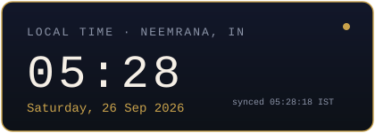

Computer Science Engineering · Bennett University · Student

## About Me

<table align="center">
<tr>
<td width="55%" valign="top">

Final-year Computer Science undergraduate with a focus on **application security, DevSecOps, and cloud security engineering**. I spend most of my time embedding security into CI/CD pipelines, triaging vulnerabilities, and building tooling that makes secure defaults the easy path for developers.

Outside of core security work, I explore adjacent research: adversarial robustness in malware classification, embedded key-fob cryptography, and applied machine learning for threat detection.

</td>
<td width="45%" align="center">

</td>
</tr>
</table>

### Right Now

<table>
<tr>
<td align="center">

 

</td>
<td align="center">

  

</td>
</tr>
</table>

## Technologia Stack

**Languages**

**Cloud, DevOps &amp; Observability**

**Security &amp; DevSecOps**

**Databases &amp; ML**

## Certifications

<table>
<tr>
<td align="center" width="33%">🎓 <b>Certified Ethical Hacker (CEH)</b> EC-Council · Feb '26</td>
<td align="center" width="33%">☁️ <b>AWS Certified Cloud Practitioner</b> AWS · Apr '26</td>
<td align="center" width="33%">🛡️ <b>Cybersecurity Essentials</b> Cisco Networking Academy · Jan '24</td>
</tr>
<tr>
<td align="center">🔐 <b>ISEA Program</b> NIT Kurukshetra · Dec '24</td>
<td align="center">🕵️ <b>Professional Cybersecurity Specialization</b> Google · Nov '24</td>
<td align="center">⚙️ <b>Software Engineering &amp; AI for Management</b> NPTEL (Elite, Top 2%) · Oct '24</td>
</tr>
<tr>
<td align="center">🧩 <b>ServiceNow Certified System Administrator</b> ServiceNow · Apr '26</td>
<td align="center">💻 <b>ServiceNow Certified Application Developer</b> ServiceNow · June '26</td>
<td align="center">✨ <i>More in progress</i></td>
</tr>
</table>

## Achievements

<table>
<tr><td width="70%"><b>Flipkart Grid 8.0</b> - Semi-Finalist</td><td align="right">National</td></tr>
<tr><td><b>IET Scholarship</b> - Top 150 of 48,000+ applicants</td><td align="right">National</td></tr>
<tr><td><b>Meesho ScriptedByHer 2.0</b> - Top 500 of 38,000+ applicants</td><td align="right">National</td></tr>
<tr><td><b>Akamai Codeathon EmpowHer 3.0</b> - Top 150</td><td align="right">National</td></tr>
<tr><td><b>Tata Imagination Challenge '24</b> - Semi-Finalist</td><td align="right">National</td></tr>
<tr><td><b>CompSIA '25 / DoSCI '25 Ideathon</b> - 1st Runner-Up</td><td align="right">Inter-University</td></tr>
<tr><td><b>SheFi Cohort</b> - Accepted, full scholarship</td><td align="right">International</td></tr>
<tr><td><b>VBYLD '26</b> - Progressed to State Level</td><td align="right">State</td></tr>
</table>

## My Recent Articles

<!-- BLOG-POST-LIST:START -->
- [ArgoCD RBAC SetUp](https://medium.com/@sanyaw12722/argocd-rbac-setup-571c4eaceedb?source=rss-8ef93f66f5f4------2)
- [Database encryption during exports](https://medium.com/@sanyaw12722/database-encryption-during-exports-2387f3b64d2c?source=rss-8ef93f66f5f4------2)
- [Want approvals before someone merges a PR on Github?](https://medium.com/@sanyaw12722/want-approvals-before-someone-merges-a-pr-on-github-f7822a8f0b06?source=rss-8ef93f66f5f4------2)
- [Methodology for SAST](https://medium.com/@sanyaw12722/methodology-for-sast-da95a36c1a48?source=rss-8ef93f66f5f4------2)
<!-- BLOG-POST-LIST:END -->

## Featured Projects

<table>
<td width="85%">

**[Credis — Academic Credit Transfer System](https://github.com/sanyaw25)**
  

Embedding-based semantic similarity engine for large-scale course matching, with an optimized vector-indexing pipeline and Auth0-backed role-based authentication.

</td>
</tr>
<td>

**[BeUnited — Digital Campus Platform](https://github.com/sanyaw25)**
  

Full-stack platform centralizing internships, events, and student organizations, with JWT-based auth, RBAC, and scalable REST APIs across FastAPI and Node.js services.

</td>
</tr>
<td>

**[Stegram — Secure File Transfer System](https://github.com/sanyaw25)**
 

Hybrid-encryption file transfer combining RSA key exchange with AES symmetric encryption, layered with steganographic embedding and cryptographic integrity verification.

</td>
</tr>
</table>

## GitHub Overview
 

 

## Live Threat Feed

## Profiles

  

  

  

  

  

© 2026 Sanya Wadhawan

If this README inspired your own profile, that's awesome! If you reuse substantial portions of the design or content, please include a link back to this repository.
