## 💗 About Me 💗

I'm a final-year CS undergrad at **Bennett University**, and this is a work in progress so don't judge it yet.

By day I secure CI/CD pipelines and hunt vulnerabilities. By night I'm probably reverse-engineering a key fob, training a malware classifier to be more paranoid than me, or I'm applying for yet another competition that somehow involves coding challenges way above my caliber.

📬 <b>Owl Post — latest update:</b> currently pursuing a research internship at Georgia Tech University. Check back for the next letter drop.

##Technologia™

**Languages**

**Cloud, DevOps & Observability**

**Security & DevSecOps**

**Databases & ML**

## 🏆 Certifications 🏆

<table>
<tr>
<td align="center">🎓 <b>Certified Ethical Hacker (CEH)</b> EC-Council · Feb '26</td>
<td align="center">☁️ <b>AWS Certified Cloud Practitioner</b> AWS · Apr '26</td>
<td align="center">🛡️ <b>Cybersecurity Essentials</b> Cisco Networking Academy · Jan '24</td>
</tr>
<tr>
<td align="center">🔐 <b>ISEA Program</b> NIT Kurukshetra · Dec '24</td>
<td align="center">🕵️ <b>Professional Cybersecurity Specialization</b> Google · Nov '24</td>
<td align="center">⚙️ <b>Software Engineering & AI for Management</b> NPTEL (Elite, Top 2%) · Oct '24</td>
</tr>
<tr>
<td align="center">🧩 <b>ServiceNow Certified System Administrator</b> ServiceNow · Apr '26</td>
<td align="center">💻 <b>ServiceNow Certified Application Developer</b> ServiceNow · June '26</td>
<td align="center">✨ <i>more incoming...</i></td>
</tr>
</table>

## 💌 Interests

- 🔐 Information Security & DevSecOps
- 🕵️‍♀️ Vulnerability Research & Bug Bounty Hunting
- ☁️ Cloud Security & Observability
- 🤖 Machine Learning for Malware Detection
- 🐉 Reading up on old-school reverse engineering & key-fob cryptography
- 🎀 Making terminal output look aesthetic (yes, that's a real interest)
- 🐱 Cat supervision (mandatory during deploys)

## 📌 Featured Projects

**[Credis](https://github.com/sanyaw25)** — Academic credit transfer system, FAISS-powered semantic course matching
**[BeUnited](https://github.com/sanyaw25)** — Full-stack digital campus platform (FastAPI + Node.js + MongoDB)
**[Stegram](https://github.com/sanyaw25)** — Secure file transfer with hybrid encryption + steganography

## 📊 GitHub Stats

### 📫 Reach Me

 

